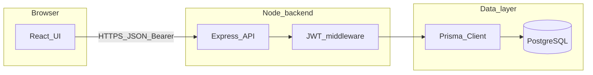

# Architecture

This project is a classic **three-tier** setup: a single-page admin UI talks to a stateless JSON API, which persists data through Prisma ORM to PostgreSQL.

## Components

1. **Frontend** (`frontend/`): Vite builds a React app. Routes and screens live under `src/routes/`. Data fetching uses TanStack Query; HTTP calls go through `src/lib/api.ts`, which attaches the JWT and handles 401 by redirecting to login.
2. **Backend** (`backend/`): Express 5 registers routers in `index.js`. `POST /api/auth/login` is public; `/users`, `/tickets`, `/subscriptions`, and `/activity` are protected by `adminAuth`, which verifies `Bearer` JWTs signed with `JWT_SECRET`.
3. **Database**: PostgreSQL. Schema and migrations live under `backend/prisma/`. The generated Prisma Client is written to `backend/generated/prisma` (custom output in `schema.prisma`).

## Request flow

Login flow: the UI sends the admin password to `/api/auth/login`; the API compares it to `ADMIN_PASSWORD`, logs the outcome to `ActivityLog`, and returns a signed JWT. Subsequent UI requests send that token; the API never stores session state in memory for those calls.

## Activity logging

Controllers call `createActivityLog` for notable admin actions (user/ticket updates, login success/failure). That writes rows the **Activity** UI reads via `GET /activity`.

## Related docs

- [README.md](../README.md) — setup and env vars
- [API.md](./API.md) — route and payload reference
- [backend/README.md](../backend/README.md) — Prisma, seed, tests
